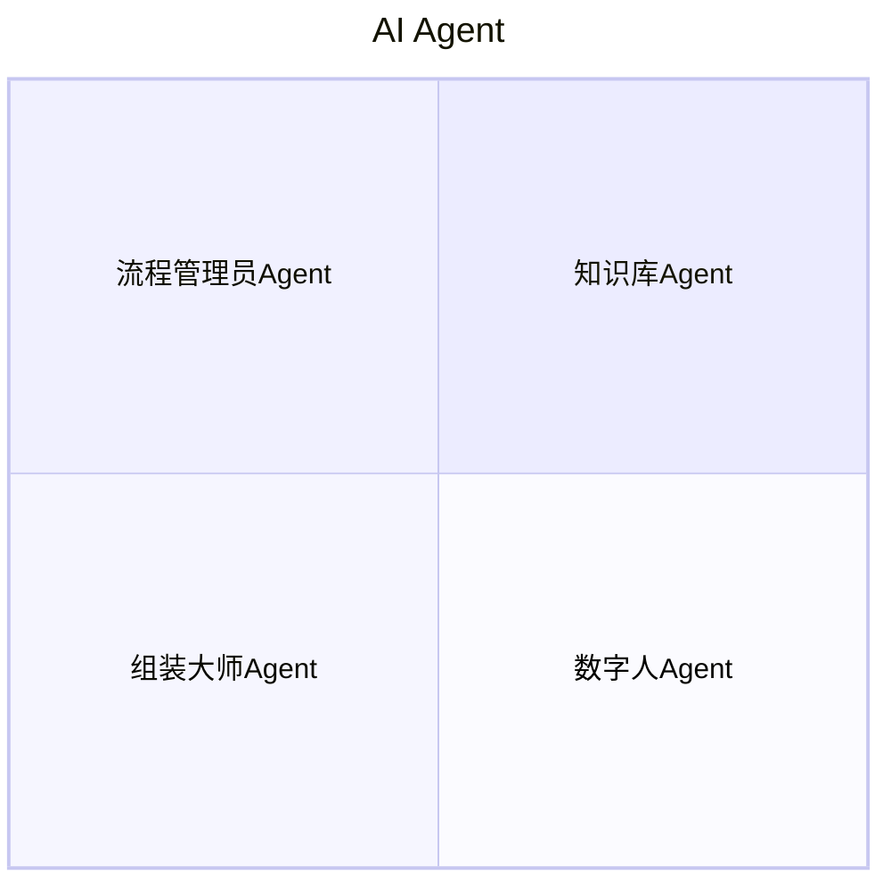
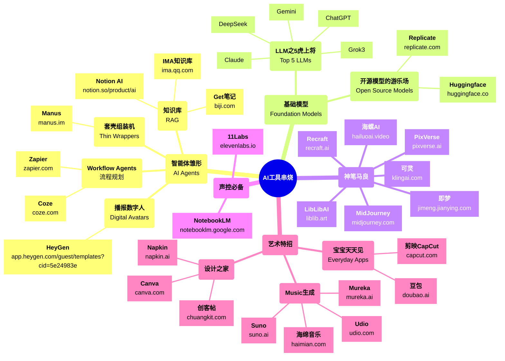

import Image from '@theme/IdealImage';
import CozeStore from '/img/coze/coze_store.png';
import Zapier from '/img/zapier/zapier_apps.png';
import HeyGen from '/img/heygen/heygen_home.png';
import NotionSvg from '/img/rag/notion.svg';
import GetPng from '/img/rag/get.png';
import ImaPng from '/img/rag/ima.png';
import CanvaSvg from '/img/design/canva.svg';
import GaodingSvg from '/img/design/gaoding.svg';
import ChuangkitSvg from '/img/design/chuangkit_logo.svg';
import NapkinSvg from '/img/design/napkin.svg';
import ReplicateSvg from '/img/cloud/replicate.svg';
import HuggingfaceSvg from '/img/cloud/huggingface.svg';
import NotebookLmSvg from '/img/txt2audio/notebooklm.svg';
import ElevenLabsSvg from '/img/txt2audio/11labs.svg';
import Manus from '/img/agent/manus.png';
import MidJourneySvg from '/img/txt2img/midjourney.svg';
import LibLibSvg from '/img/txt2img/liblib.svg';
import KlingSvg from '/img/txt2img/kling.svg';
import PixVerseSvg from '/img/txt2img/pixverse.svg';
import RecraftSvg from '/img/txt2img/recraft2.svg';
import HaiLuoPng from '/img/txt2img/hailuo.png';
import JiMengPng from '/img/txt2img/jimeng.png';

import HaimianSvg from '/img/music/haimian.svg';
import MurekaPng from '/img/music/mureka_ss.png';
import SunoSvg from '/img/music/suno.svg';
import UdioSvg from '/img/music/udio.svg';
import JohnJpg from '/img/john.jpg';
import CapcutSvg from '/img/video/capcut.svg';
import DoubaoPng from '/img/agent/doubao.png';

import TOCInline from '@theme/TOCInline';
import ControlPanel from '@site/src/components/util/ControlPanel';

<!-- <ControlPanel /> -->

<!-- <Image img={JohnJpg} /> -->

<TOCInline toc={toc} />

# 最常用GenAI工具串烧

<!-- truncate -->

## 高级智能

:::info
传说中的智能体 AI Agent = AI代理
:::



### 知识库

| **IMA知识库** (微信亲生)                                               | Get笔记 (得到亲生)                                                                  | Notion AI                                                                  |
| ---------------------------------------------------------------------- | ------------------------------------------------------------------------ | -------------------------------------------------------------------------- |
| 微信亲生的知识库, <br/>可添加聊天文件, 公众号文章                      | 语音输入 自动总结                                                        | Notion配套 笔记之王                                                        |
| [<Image img={ImaPng} width={100} height={100} />](https://ima.qq.com/) | [<Image img={GetPng} width={100} height={100} />](https://www.biji.com/) | [<NotionSvg width={100} height={100} />](https://www.notion.so/product/ai) |

### 流程管理

| [Coze](https://www.coze.com/)                      | [**Zapier**](https://zapier.com/)             |
| -------------------------------------------------- | --------------------------------------------- |
| [<Image img={CozeStore} />](https://www.coze.com/) | [<Image img={Zapier} />](https://zapier.com/) |

### 套壳组装机 

<details open>
  <summary>Manus</summary>
  <div>
    [<Image img={Manus} />](https://manus.im/)
  </div>
</details>

### 播报数字人

<details open>
  <summary>HeyGen</summary>
  <div>
    [<Image img={HeyGen} />](https://app.heygen.com/guest/templates?cid=5e24983e)
  </div>
</details>

## 基础模型

### LLM之5虎上将

| ChatGPT                              | DeepSeek                        | Gemini            | Grok3                                              | **Claude**                              |
| ------------------------------------ | ------------------------------- | ----------------- | -------------------------------------------------- | --------------------------------------- |
| "咋让ChatGPT每天8点给我发送BTC新闻?" | 精通中文 <br/>"施主, 算一卦么?" | 谷歌亲生 生态集成 | 连通X 搜索狂野 <br/>"调研NVDA的业务和预测下周走势" | 精于术数 编程之王 <br/>驾驭浏览器自动化 |

### 神笔马良甄选

:::info 入门首选
先从LibLibAI开始
:::

| MidJourney                                                                | **LibLibAI**                                                      | 海螺AI                                                                        | 可灵                                                                     | 即梦                                                                               | PixVerse                                                             | Recraft                                                            | 剪映 CapCut                                                       |
| ------------------------------------------------------------------------- | ----------------------------------------------------------------- | ----------------------------------------------------------------------------- | ------------------------------------------------------------------------ | ---------------------------------------------------------------------------------- | -------------------------------------------------------------------- | ------------------------------------------------------------------ | ----------------------------------------------------------------- |
| 文生图之王                                                                | 模型无数 一键生图                                                 | 视频优质                                                                      | 文生视频 快手亲生                                                        | 剪映旗下 字节亲生                                                                  | 3D 视频高清                                                          | AI修图Pro                                                          | 视频创作                                                          |
| [<MidJourneySvg width={100} height={100} />](https://www.midjourney.com/) | [<LibLibSvg width={100} height={100} />](https://www.liblib.art/) | [<Image img={HaiLuoPng} width={100} height={100} />](https://hailuoai.video/) | [<KlingSvg width={100} height={100} />](https://www.klingai.com/global/) | [<Image img={JiMengPng} width={100} height={100} />](https://jimeng.jianying.com/) | [<PixVerseSvg width={100} height={100} />](https://www.pixverse.ai/) | [<RecraftSvg width={100} height={100} />](https://www.recraft.ai/) | [<CapcutSvg width={100} height={100} />](https://www.capcut.com/) |

### 设计之家

:::info 入门首选
Canva 从业余到专业 从海报到海选 你都用的上
:::


| **Canva**                                                       | 创客帖                                                                  | Napkin                                                           |
| --------------------------------------------------------------- | ----------------------------------------------------------------------- | ---------------------------------------------------------------- |
| [<CanvaSvg width={100} height={100} />](https://www.canva.com/) | [<ChuangkitSvg width={100} height={100} />](https://www.chuangkit.com/) | [<NapkinSvg width={100} height={100} />](https://www.napkin.ai/) |
| Pro设计之王                                                     | 模版精选                                                                | 极简                                                             |

### 声控必备

:::info 11Labs
先体验11Labs 可以弥补一切AI视频软件的声音
:::

| **11Labs**                                                           | NotebookLM                                                                   |
| -------------------------------------------------------------------- | ---------------------------------------------------------------------------- |
| [<ElevenLabsSvg width={100} height={100} />](https://elevenlabs.io/) | [<NotebookLmSvg width={300} height={100} />](https://notebooklm.google.com/) |
| 字幕变音频 <br/>声音克隆 生音之王                                    | 创作podcast播客 <br/>Google亲生 生态集成                                     |

### Music

| **Suno**                                                 | Udio                                                          | Mureka                                                                   | 海绵音乐                                                            |
| -------------------------------------------------------- | ------------------------------------------------------------- | ------------------------------------------------------------------------ | ------------------------------------------------------------------- |
| [<SunoSvg width={100} height={100} />](https://suno.ai/) | [<UdioSvg width={100} height={100} />](https://www.udio.com/) | [<Image img={MurekaPng} width={100} height={100} />](https://mureka.ai/) | [<HaimianSvg width={150} height={100} />](https://www.haimian.com/) |

:::info Suno
Suno为龙头首选 上手练习 跟ChatGPT写出歌词变成**歌曲** 人人皆可作音乐
:::

### 宝宝天天见

:::info
若你对其他应用毫无兴趣 那就只用豆包吧
:::

| 豆包                                                                                        |
| ------------------------------------------------------------------------------------------- |
| [<Image img={DoubaoPng} style={{width: '80px', height: '80px'}} />](https://www.doubao.ai/) |
| 综合型AI应用 听说读写 会议记录 搜索助理                                                     |


### 开源模型的游乐场

> "放过自己的电脑吧 他们跑不起来大模型 "

:::danger 超越

边界之外 竞争之先

Replicate Explore要持续探索 从小白到高手 一个都不落
:::

| **Replicate**                                                              | Huggingface                                                            |
| -------------------------------------------------------------------------- | ---------------------------------------------------------------------- |
| [<ReplicateSvg width={100} height={100} />](https://replicate.com/explore) | [<HuggingfaceSvg width={100} height={100} />](https://huggingface.co/) |
| 开原模型精中选优 <br/>一键运行 $0.01                                       | ML之模型和数据的总库                                                   |

------

## 总结 {#summary}

### 思维导图



### AI常用工具串串烧 {#flowchart}

```mermaid
flowchart TB
    Agents --> Foundation
    Foundation --> Models
    
    subgraph Agents["智能体雏形<br/>AI Agents"]
        direction TB
        subgraph Workflow["流程Agents"]
            subgraph WorkflowTools["流程规划工具"]
                direction LR
                Coze@{ img: '/img/coze/coze_store.png', label: "Coze<br/>coze.com", pos: "t", w: 260, h: 160}
                Zapier@{ img: '/img/zapier/zapier_apps.png', label: "Zapier<br/>zapier.com", pos: "t", w: 260, h: 160}
            end
        end
        subgraph Wrapper["套壳组装机"]
            subgraph WrapperTools["组装工具"]
                Manus@{ img: '/img/agent/manus.png', label: "Manus<br/>manus.im", pos: "t", w: 160, h: 160}
            end
        end
        subgraph Avatar["播报数字人Agent"]
            subgraph AvatarTools["数字人工具"]
                HeyGen@{ img: '/img/heygen/heygen_home.png', label: "HeyGen<br/>app.heygen.com/guest/templates?cid=5e24983e", pos: "t", w: 160, h: 160}
            end
        end
        subgraph RAG["知识库Agent"]
            subgraph RAGTools["知识库工具"]
                direction LR
                IMA@{ img: '/img/rag/ima.png', label: "IMA知识库<br/>ima.qq.com", pos: "t", w: 80, h: 80, constraint: on }
                Get@{ img: '/img/rag/get.png', label: "Get笔记<br/>biji.com", pos: "t", w: 80, h: 60}
                Notion@{ img: '/img/rag/notion.svg', label: "Notion AI<br/>notion.so/product/ai", pos: "t", w: 80, h: 80, constraint: on }
            end
        end
    end

    subgraph Foundation["模型的直接应用层"]
        direction TB
        subgraph Drawing["神笔马良"]
            direction TB
            subgraph Photo
                direction LR
                MidJourney@{ img: '/img/txt2img/midjourney.svg', label: "MidJourney<br/>midjourney.com", pos: "t", w: 160, h: 160, constraint: on }
                LibLib@{ img: '/img/txt2img/liblib.svg', label: "LibLibAI<br/>liblib.art", pos: "t", w: 100, h: 100, constraint: off }
                Recraft@{ img: '/img/txt2img/recraft2.svg', label: "Recraft<br/>recraft.ai", pos: "t", w: 160, h: 160, constraint: on }
            end
            subgraph Video
                direction LR
                Capcut@{img: '/img/video/capcut.svg', label: "剪映CapCut<br/>capcut.com", pos: "t", w: 160, h: 160, constraint: on }
                Hailuo@{img: '/img/txt2img/hailuo.png', label: "海螺AI<br/>hailuoai.video", pos: "t", w: 160, h: 100, constraint: off }
                Kling@{img: '/img/txt2img/kling.svg', label: "可灵<br/>klingai.com", pos: "t", w: 100, h: 100, constraint: on }
                Jimeng@{img: '/img/txt2img/jimeng.png', label: "即梦<br/>jimeng.jianying.com", pos: "t", w: 160, h: 100, constraint: off }
                PixVerse@{img: '/img/txt2img/pixverse.svg', label: "PixVerse<br/>pixverse.ai", pos: "t", w: 160, h: 100, constraint: off }
            end
            
            subgraph DesignTools["设计Pro"]
                direction LR
                Canva@{ img: '/img/design/canva.svg', label: "Canva<br/>canva.com", pos: "t", w: 160, h: 160, constraint: off }
                Chuangkit@{ img: '/img/design/chuangkit_logo.svg', label: "创客帖<br/>chuangkit.com", pos: "t", w: 160, h: 120, constraint: off }
                Napkin@{ img: '/img/design/napkin.svg', label: "Napkin<br/>napkin.ai", pos: "t", w: 160, h: 100, constraint: off }
            end
        end
        
        subgraph Voice["声控必备"]
            direction LR
            subgraph VoiceGeneration["声音生成"]
                ElevenLabs@{ img: '/img/txt2audio/11labs.svg', label: "11Labs<br/>elevenlabs.io", pos: "t", w: 160, h: 100, constraint: off }
                NotebookLM@{ img: '/img/txt2audio/notebooklm.svg', label: "NotebookLM<br/>notebooklm.google.com", pos: "t", w: 160, h: 100, constraint: off }
            end

            subgraph MusicTools["音乐工具"]
                direction LR
                Suno@{ img: '/img/music/suno.svg', label: "Suno suno.ai", pos: "t", w: 160, h: 160, constraint: on }
                Udio@{ img: '/img/music/udio.svg', label: "Udio udio.com", pos: "t", w: 160, h: 160, constraint: on }
                Mureka@{ img: '/img/music/mureka_ss.png', label: "Mureka mureka.ai", pos: "t", w: 160, h: 120, constraint: off }
                Haimian@{ img: '/img/music/haimian.svg', label: "海绵音乐 haimian.com", pos: "t", w: 160, h: 160, constraint: on }
            end        
        end
    end

    subgraph Models["基础模型"]
        direction TB
        subgraph LLM["LLM之5虎上将<br/>Top 5 LLMs"]
            subgraph LLMTools["主流大模型"]
                direction TB
                ChatGPT["ChatGPT"]
                DeepSeek["DeepSeek"]
                Gemini["Gemini"]
                Grok3["Grok3"]
                Claude["Claude"]
            end
        end
        subgraph OpenSource["开源模型的游乐场"]
            subgraph OpenSourceTools["开源平台"]
                direction TB
                Replicate@{ img: '/img/cloud/replicate.svg', label: "Replicate<br/>replicate.com", pos: "t", w: 160, h: 160}
                Huggingface@{ img: '/img/cloud/huggingface.svg', label: "Huggingface<br/>huggingface.co", pos: "t", w: 160, h: 160}
            end
        end
    end
        
    %% Connect main categories to their tools
    Wrapper --> WrapperTools
    Avatar --> AvatarTools
    RAG --> RAGTools
    
    LLM --> LLMTools
    OpenSource --> OpenSourceTools
        
    %% Styling
    classDef rootNode fill:#f9f,stroke:#333,stroke-width:2px
    classDef categoryNode fill:#bbf,stroke:#333,stroke-width:1px
    classDef toolNode fill:#ddf,stroke:#333,stroke-width:1px
    
    class Root rootNode
    class Agents,Models,Drawing,Voice,Art categoryNode
    class Workflow,Wrapper,Avatar,RAG,LLM,OpenSource,Music,Daily categoryNode
    class Coze,Zapier,Manus,HeyGen,IMA,Get,Notion,ChatGPT,DeepSeek,Gemini,Grok3,Claude,Replicate,Huggingface,MidJourney,LibLib,Hailuo,Kling,Jimeng,PixVerse,Recraft,ElevenLabs,NotebookLM,Canva,Chuangkit,Napkin,Suno,Udio,Mureka,Haimian,Doubao,Capcut toolNode
```

## 心法 {#methodology}

:::tip _工欲善其事必先利其器, 那么..._

1. 何谓善用科技?
> "杀鸡用屠龙刀 大炮专打蚊子 => 体验用高级工具降维打击的奢侈感"

2. 何谓"__好钢要使在刀刃上__"?
> "屠龙刀: 又cue俺? 忙着切肉呢😡"
> 
> "找对场景!!!"
:::

:::danger 希望大家 善用工具 驾驭科技 跨越裂谷 成为先驱 而非先烈
>  _"若非生活所迫, 谁愿满身才华?"_ `<=>` _"Stay hungry, stay foolish."_ 
:::
