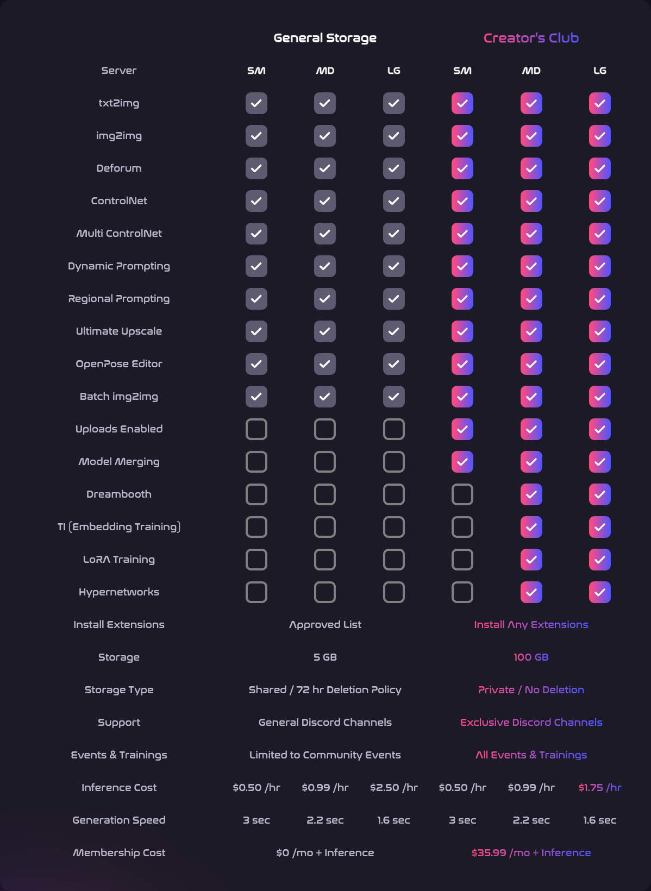
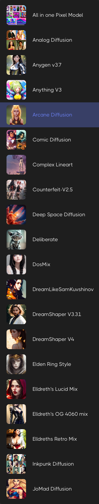

import MDXTemplate from '../../src/components/HomepageFeatures/MDXTemplate';
import { YouTube } from 'mdx-embed';

<MDXTemplate> 
# Introduction

:::info
[Run Diffusion](https://app.rundiffusion.com/?ref=jing49) is a place to run your own Stable Diffusion model
:::

### Demo
<YouTube youTubeId="xul4nDHvxgg" skipTo={{
    h: 0,
    m: 10,
    s: 44
}} />
</MDXTemplate>

## Slides
- charge based on per hour from USD $0.5/hr
- [Full Features](https://rundiffusion.com/creators-club)
    
- many models to select
    
    
- [RunDiffusion docs](https://learn.rundiffusion.com/)

## Integrations

- DreamBooth
- Automatic1111
- Deforum
- SD (Stable Diffusion)
  - ControlNet

## channels
- [YouTube](https://www.youtube.com/@rundiffusion)
- [Discord](https://discord.com/invite/wH6dTyBpCf)
- [Twitter](https://twitter.com/ghost)
