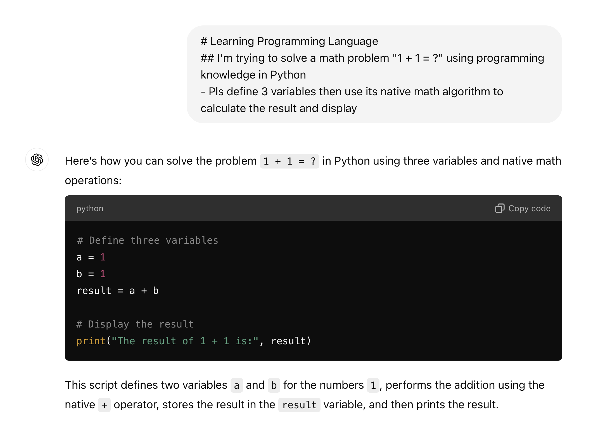
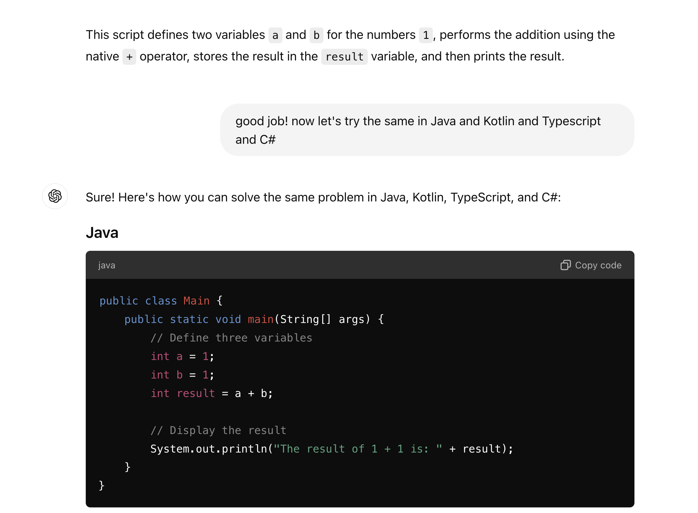
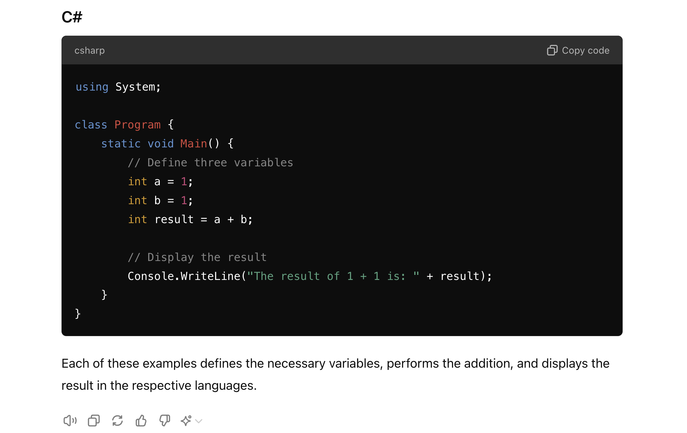

# How-to become one Full Stack AI-Copilot Developer

- what is **AI-Copilot**?
    - Simply saying, "_your best friend, AI, will help you do coding._"

- what will we learn today (`<60 minutes`)?
    - you will have a structural concepts of programming languages
    - you will learn how to command your AI friend to do coding for you
    - that's almost there but, the last thing is _**CELEBRATE**_ ! 🎉
- Prerequisite
  - Elementary school graduate

## Outline - 3 Modules

> we will only learn 3 modules within one hour,and each of them will apply to all the programming languages: variables, functions, and classes.

## Purpose - Have Fun

Now that we've outlined our learning path, it's time to dive into the fascinating world of programming languages. We'll explore variables, functions, and classes across Java, Kotlin, Python, TypeScript, and C#. 

Remember, the goal is **NOT to memorize every detail**, and **NOT to become an coding guru**, but to understand the core concepts thus to be able to build software products to generate revenue $$$ in real-world. This comparative approach will help you grasp the underlying principles of programming and adapt more easily to new languages in the future.

### What NOT ? {#what-is-not}
:::info What NOT ?
- NOT make you a coding guru.
- NOT master all the knowledge
- NOT remember coding techniques
- NOT learn how to code !!!
:::

### What is ? {#what-is}
:::tip What is ?
- Just learn how to make AI code for you !
:::

Let's start with variables, the building blocks of any program!

## Variables

:::info
- every language has variables, such as Math. All you need to understand in this module is only a few things:
  - what are the basic data types in each language?
  - how to define a variable?
  - how to assign a value to a variable?
:::

### basic data types

Let's get a quick list of **basic** data types for each language:

> at this moment you can simply remember that most of the main stream high level languages have the same set of **basic** data types:

- **Number**, such as integer, float (with decimals)
- True or False, Yes or No -> we call it "**boolean**"
- Text -> we call it "**String**"
- **Collection** to store multiple items such as the above three types (number, boolean, string, and any other types):    
- **List (Array)**: Like a backpack where you can put many things in order. You can add, remove, or look at items easily.
- **Dictionary (Map)**: Like a word dictionary, but instead of words and meanings, you can store any pairs of things. For example, names and their favorite colors

:::tip celebrate
🎉 Congratulations! You've just learned the **basic** data types in all the popular programming languages in 1 minute! 🎉🎉🎉

Now pls speak out loud: "I can understand **basic** data types in all the popular programming languages now! They are number, boolean, string, and collection which includes list and dictionary." 🎉🕺💃🎉
:::

:::note details and bad memory
well technically, there are more details into the types, however, we'll leave it to AI so that you are worry free for now. 🥂

> "What if I can NOT even remember these **data types**?"
- Easy! Simply ask ChatGPT or your favorite AI, "_what are the basic data types in all the popular programming languages?_"
- Homework: So why not give a try and see what AI can tell you?
:::

### define and use variables

:::info usage of data types
> so why would we need to understand data types?

Because we need them to define variables!
:::

> Just like in Math we usually define a variable and calculate math formula. Now in this section, let's solve a Grade 1 Math problem using programming code:

:::info 1 + 1 = ?
:::

:::danger Speeding Alert 🚗💨💨💨
That's a great question! Everyone wanna know the answer, right?

Now we are going to solve this famous problem using 5 different programming languages.

Please buckle up your seatbelt! Enjoy the speeding ride! 🚀
:::

First let's look at this question - it's adding up 2 numbers and getting one result, so 3 numbers right? So let's our best friend AI about this question:

```md
# Learning Programming Language 
## I'm trying to solve a math problem "1 + 1 = ?" using programming knowledge in Python
- Pls define 3 variables then use its native math algorithm to calculate the result and display
```

Now let's see the result:



That's it! You got it? 🎉 Don't forget to **celebrate**! We'll help you celebrate in the end of this section when you learn all the programming languages 😄

Now let's try another language, Java, Kotlin, TypeScript, and C#






:::info
Don't worry about how to run the code, we'll learn it in next course later. But tell you the secret that it is very easy!
:::

They look similar, right? Yes and that's it! Simple as that!
So you got it? I guess so! Let's celebrate! 🎉

:::tip celebrate
🎉 Congratulations! You've just learned how to define **number** variables in all the popular programming languages in 1 minute! 🎉🎉🎉

Now pls speak out loud: "I can define **number** variables in all the popular programming languages now!" 🎉🕺💃🎉
:::

:::note other data types?
> "now I've learnt the number, what about the string, boolean, and collection?"

- Good question and good memory! You still remember them! However, also remember our goal is to get AI to code for us! Actually as long as you have the idea of the concepts about this piece of knowledge, you've got it! The rest of further details will be taken care of by your best friend AI!
- Actually you will see them in the [next section](#functions)
> ["NOT master all the knowledge"](#what-is-not)
:::

## Functions

## Classes

