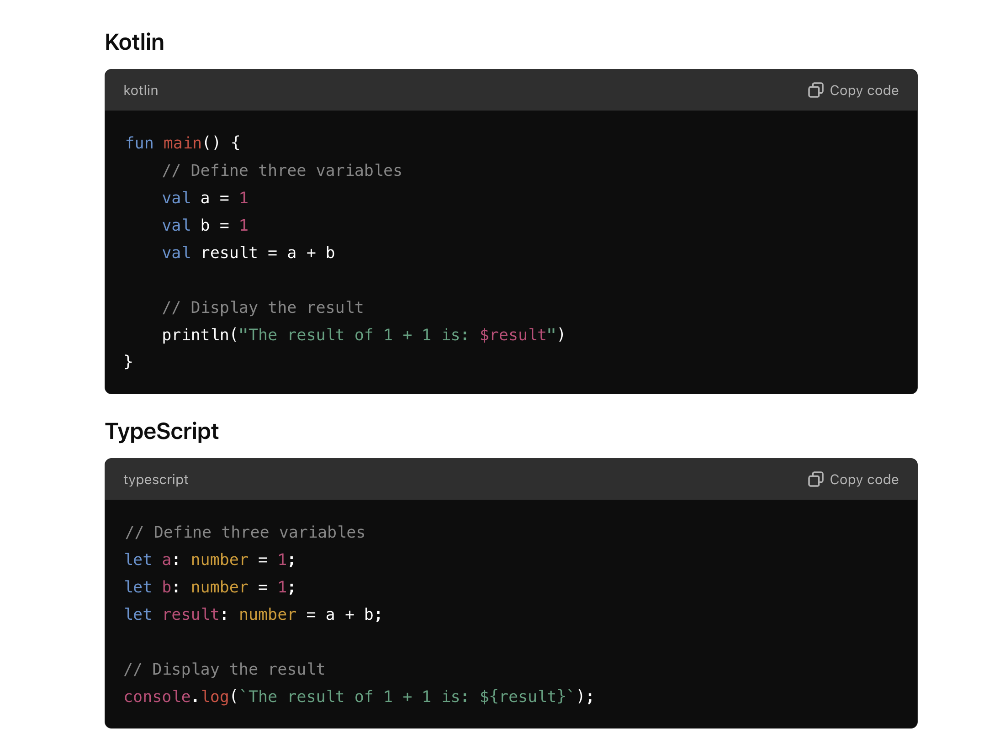

import Tabs from '@theme/Tabs';
import TabItem from '@theme/TabItem';

# How-to become one Full Stack AI-Copilot Developer

- what is **AI-Copilot**?
    - Simply saying, "_your best friend, AI, will help you do coding._"

- what will we learn today (`<60 minutes`)?
    - you will have a structural concepts of programming languages
    - you will learn how to command your AI friend to do coding for you
    - that's almost there but, the last thing is _**CELEBRATE**_ ! 🎉
- Prerequisite
  - Elementary school graduate

## Outline - 3 Modules

> we will only learn 3 modules within one hour,and each of them will apply to all the programming languages: variables, functions, and classes.

## Purpose - Have Fun

Now that we've outlined our learning path, it's time to dive into the fascinating world of programming languages. We'll explore variables, functions, and classes across Java, Kotlin, Python, TypeScript, and C#. 

Remember, the goal is **NOT to memorize every detail**, and **NOT to become an coding guru**, but to understand the core concepts thus to be able to build software products to generate revenue $$$ in real-world. This comparative approach will help you grasp the underlying principles of programming and adapt more easily to new languages in the future.

### What NOT ? {#what-is-not}
:::info What NOT ?
- NOT make you a coding guru.
- NOT master all the knowledge
- NOT remember coding techniques
- NOT learn how to code !!!
:::

### What is ? {#what-is}
:::tip What is ?
- Just learn how to make AI code for you !
:::

Let's start with variables, the building blocks of any program!

## Variables

:::info
- every language has variables, such as Math. All you need to understand in this module is only a few things:
  - what are the basic data types in each language?
  - how to define a variable?
  - how to assign a value to a variable?
:::

### basic data types

Let's get a quick list of **basic** data types for each language:

> at this moment you can simply remember that most of the main stream high level languages have the same set of **basic** data types:

- **Number**, such as integer, float (with decimals)
- True or False, Yes or No -> we call it "**boolean**"
- Text -> we call it "**String**"
- **Collection** to store multiple items such as the above three types (number, boolean, string, and any other types):    
- **List (Array)**: Like a backpack where you can put many things in order. You can add, remove, or look at items easily.
- **Dictionary (Map)**: Like a word dictionary, but instead of words and meanings, you can store any pairs of things. For example, names and their favorite colors

:::tip celebrate
🎉 Congratulations! You've just learned the **basic** data types in all the popular programming languages in 1 minute! 🎉🎉🎉

Now pls speak out loud: "I can understand **basic** data types in all the popular programming languages now! They are number, boolean, string, and collection which includes list and dictionary." 🎉🕺💃🎉
:::

:::note details and bad memory
well technically, there are more details into the types, however, we'll leave it to AI so that you are worry free for now. 🥂

> "What if I can NOT even remember these **data types**?"
- Easy! Simply ask ChatGPT or your favorite AI, "_what are the basic data types in all the popular programming languages?_"
- Homework: So why not give a try and see what AI can tell you?
:::

### define and use variables

:::info usage of data types
> so why would we need to understand data types?

Because we need them to define variables!
:::

> Just like in Math we usually define a variable and calculate math formula. Now in this section, let's solve a Grade 1 Math problem using programming code:

:::info 1 + 1 = ?
:::

:::danger Speeding Alert 🚗💨💨💨
That's a great question! Everyone wanna know the answer, right?

Now we are going to solve this famous problem using 5 different programming languages.

Please buckle up your seatbelt! Enjoy the speeding ride! 🚀
:::

First let's look at this question - it's adding up 2 numbers and getting one result, so 3 numbers right? So let's our best friend AI about this question:

```md
# Learning Programming Language 
## I'm trying to solve a math problem "1 + 1 = ?" using programming knowledge in Python
- Pls define 3 variables then use its native math algorithm to calculate the result and display
```

Now let's see the result:


That's it! You got it? 🎉 Don't forget to **celebrate**! We'll help you celebrate in the end of this section when you learn all the programming languages 😄

Now let's try another language, Java, Kotlin, TypeScript, and C#





:::info
Don't worry about how to run the code, we'll learn it in next course later. But tell you the secret that it is very easy!
:::

They look similar, right? Yes and that's it! Simple as that!
So you got it? I guess so! Let's celebrate! 🎉

:::tip celebrate
🎉 Congratulations! You've just learned how to define **number** variables in all the popular programming languages in 1 minute! 🎉🎉🎉

Now pls speak out loud: "I can define **number** variables in all the popular programming languages now!" 🎉🕺💃🎉
:::

:::note other data types?
> "now I've learnt the number, what about the string, boolean, and collection?"

- Good question and good memory! You still remember them! However, also remember our goal is to get AI to code for us! Actually as long as you have the idea of the concepts about this piece of knowledge, you've got it! The rest of further details will be taken care of by your best friend AI!
- Actually you will see them in the [next module - function](#functions)
> _We would [NOT master all the knowledge](#what-is-not)_
:::

## Function

### what is function? {#what-is-function}

> function, a.k.a "method" or program,is like a formula: you give some inputs, and it will get you some outputs (actions counted as a type of output)

### why do we need function? {#why-do-we-need-function}

> because human is lazy LOL 😂, however, we are proud of it LOL 😆

:::info question 2+2=?
Let's prove that human is lazy but you are proud of it:
- you've already know how to calculate 1+1, right? now let's calculate 2+2=?
- then you will calculate 3+3=?
- then 4+4=?
- then 5+5=?
- then 6+6=?
- ...
:::

I believe this will be your code or similar idea:

```python
# python code

# 1 + 1
a = 1
b = 1
result = a + b
print(f"{a} + {b} = {result}")

# 2 + 2
c = 2
d = 2
result2 = c + d
print(f"{c} + {d} = {result2}")

# 3 + 3
e = 3
f = 3
result3 = e + f
print(f"{e} + {f} = {result3}")

# 4 + 4
g = 4
h = 4
result4 = g + h
print(f"{g} + {h} = {result4}")

# 5 + 5
i = 5
j = 5
result5 = i + j
print(f"{i} + {j} = {result5}")

# 6 + 6
k = 6
l = 6
result6 = k + l
print(f"{k} + {l} = {result6}")

# count: around ~40 lines of code
```

Are you feeling tired? I believe you are!

Wanna be a proudly lazy human developer? I bet you do!

Let's see how AI can help us with this problem:


So the function in python is:

```python
def calculate_sum(a, b):
    result = a + b
    print(f"{a} + {b} = {result}")
```

- the name of function, `calculate_sum`, does NOT matter and you can name it whatever you want.
- what if we rename it to simply the `sum`?
  
    ```python
    def sum(a, b):
        result = a + b
        print(f"{a} + {b} = {result}")
    ```

Got it? I bet you do! And that's all as basics of function!

Furthermore, let's play around a little bit more for the function(s):

1. functions can call another function, well, just like your Math formula can call another Math formula, right? In this case, we let `sum` function return the sum result as number and update the `calculate_sum` function to call the `sum` function for the result then display it. 
   1. first of first, remember functino can return some outputs right? so we update `sum` to return the sum up result.
   2. secondly, we update `calculate_sum` to call `sum` function for the result then display it, where its output is actually an action, which is displaying the result.
   3. Let's see how your best friend AI can do it:
   
2. Furthermore, let's play further with boolean and string:
   1. let's check if a and b are equal within `calculate_sum`: display "a and b are (not) equal" by using new boolean variable. 
   2. we'll define a variable of string type to store the displaying information of the piece `"{a} + {b} = {result}"` then display it.
   3. Let's see how your best friend AI can do it:
   
   
3. What if we wanna calculate all the way to `10+10=?`?
    ```python
    calculate_sum(1, 1)
    calculate_sum(2, 2)
    calculate_sum(3, 3)
    calculate_sum(4, 4)
    calculate_sum(5, 5)
    calculate_sum(6, 6)
    calculate_sum(7, 7)
    calculate_sum(8, 8)
    calculate_sum(9, 9)
    calculate_sum(10, 10)
    ```
4. Wanna be lazier? Let's use "loop": 🚀
   - 
   - Yes you are using a "for loop" to do it:
        ```python
        for i in range(1, 11):
            calculate_sum(i, i)
        ```
   - there is another type of loop called "while loop" which is another way to do it:
   
     - yes that's the while loop:
        ```python
        i = 1
        while i <= 10:
            calculate_sum(i, i)
            i += 1
        ```
    - okay! "loop" look simpler right? I bet you get its idea!
      - `for` loop is used for a known number of times such as `10`, 
      - while `while` loop is used for an unknown number of times but known condition such as `i <= 10`.
      - you've already got the syntax of `for` loop and `while` loop in Python, and believe me, your AI friend can always help me write them whenever you mention "for/while loop" in the conversation 😎
5. give it a try to other programming languages:
    
    
    
    

:::warning proud of yourself
> "Proud of being a lazy human developer?"
- Yes! I bet you are! And you should be!
:::

:::tip celebrate
🎉 Congratulations! You've just learned how to define and use a **function** in all the major programming languages in 10 minute! 🎉🎉🎉

Now pls speak out loud: "I can define and use **function** in all the popular programming languages now!" 🎉🕺💃🎉
:::

## Class

### what is class? {#what-is-class}

A class is like a mold (or template). 🚗

Imagine you're making toy cars:

- Every toy car has wheels, a body, and a color, right? 🛞🏎️🎨
- But you can't start from scratch each time you make a new car. You need a mold so that each car can be made easily.
- This mold is what we call a class.

In programming, a class is this mold:

- It helps you define what features (attributes) an object (like a car) should have and what it can do (functions).
- Then you can use this mold to make many "cars" (these cars are objects). Each car has the same basic design but can have different details, like different colors.

Using this class (mold), you can conveniently reuse the design and save time. ⏱️

For example, a "Car" class might include:
- Attributes: color, model, speed
- Functions: start, accelerate, brake

This way, when you want to create new cars in your program, you can use this "Car" class template. It's a way to organize and reuse code, making it easier to create many similar things in your program. 🚙🚗🚕

### Why do we need `class`? {#why-do-we-need-class}

> well in one word, again, because human is lazy and you wanna be much lazier LOL 😂

- `class` can help you organize your variables and functions in a structured way
- `class` can help you reuse the code written by your own, and others
- `class` can help you hide the details and only expose the necessary parts of the code
- `class` can help you inherit the properties and methods from the parent class
- `class` therefore can help you write less code technically 

:::tip car mold
```md
Let's build a Car Class in Java, which has:
- speed
- color
- model
and the car can do:
- start
- accelerate
- brake
```
Again, paste the above prompt to your AI friend, and you will get a similar result like below:
:::

<details>
    <summary>Click to see Java code</summary>
    <Tabs>
        <TabItem value="java" label="Java">
        ```java
        public class Car {
            // Attributes of the Car
            private int speed;
            private String color;
            private String model;

            // Constructor to initialize the car's attributes
            public Car(String model, String color) {
                this.model = model;
                this.color = color;
                this.speed = 0; // Initial speed is 0 when the car is created
            }

            // Method to start the car
            public void start() {
                // set default speed to 50
                speed
                System.out.println("The car has started.");
            }

            // Method to accelerate the car
            public void accelerate(int increment) {
                if (increment > 0) {
                    speed += increment;
                    System.out.println("The car has accelerated. Current speed: " + speed + " km/h");
                } else {
                    System.out.println("Invalid acceleration value.");
                }
            }

            // Method to apply brake and reduce the speed
            public void brake(int decrement) {
                if (decrement > 0 && decrement <= speed) {
                    speed -= decrement;
                    System.out.println("The car has slowed down. Current speed: " + speed + " km/h");
                } else if (decrement > speed) {
                    speed = 0;
                    System.out.println("The car has come to a complete stop.");
                } else {
                    System.out.println("Invalid brake value.");
                }
            }

            // Method to display the car's details
            public void showDetails() {
                System.out.println("Car Model: " + model);
                System.out.println("Car Color: " + color);
                System.out.println("Current Speed: " + speed + " km/h");
            }

            // usage of the Car Class: Main method to demonstrate how-to use Car class
            public static void main(String[] args) {
                // Create a new car object
                Car myCar = new Car("Tesla Model 3", "Red");
                // Start the car
                myCar.start();
                // Display car details
                myCar.showDetails();
                // Accelerate the car
                myCar.accelerate(30);
                // Show current details
                myCar.showDetails();
                // slow down the car
                myCar.brake(10);
                // Further accelerate
                myCar.accelerate(50);
                // Brake the car to a stop
                myCar.brake(80);
                // Show final details
                myCar.showDetails();
            }
        }
        ```
        </TabItem>
    </Tabs>
</details>

:::warning AI can explain the code
I assume you can easily understand the idea of the code, however, if you have any question, pls just ask your AI friend, and it will explain it to you very well.
:::

:::info homework
Now it's time to see what the Car Class code looks like in Python, Kotlin, TypeScript, and C#. Pls try to get help with your AI friend.
Believe or not, this is super easy!

you can continue the conversation with your AI friend:
```md
good job! pls rewrite the above Java code to a few languages but without any comment :
1. python
2. kotlin
3. typescript
4. c#
```
:::

<details>
    <summary>After you get your result, feel free to check here for curiosity only</summary>
    <Tabs>
        <TabItem value="python" label="Python">
        ```python
        class Car:
            def __init__(self, model, color):
                self.speed = 0
                self.color = color
                self.model = model

            def start(self):
                print("The car has started.")

            def accelerate(self, increment):
                if increment > 0:
                    self.speed += increment
                    print(f"The car has accelerated. Current speed: {self.speed} km/h")
                else:
                    print("Invalid acceleration value.")

            def brake(self, decrement):
                if decrement > 0 and decrement <= self.speed:
                    self.speed -= decrement
                    print(f"The car has slowed down. Current speed: {self.speed} km/h")
                elif decrement > self.speed:
                    self.speed = 0
                    print("The car has come to a complete stop.")
                else:
                    print("Invalid brake value.")

            def show_details(self):
                print(f"Car Model: {self.model}")
                print(f"Car Color: {self.color}")
                print(f"Current Speed: {self.speed} km/h")


        my_car = Car("Tesla Model 3", "Red")
        my_car.start()
        my_car.show_details()
        my_car.accelerate(30)
        my_car.brake(10)
        my_car.accelerate(50)
        my_car.brake(80)
        my_car.show_details()
        ```
</TabItem>
<TabItem value="kotlin" label="Kotlin">
        ```kotlin
        class Car(val model: String, val color: String) {
            var speed = 0

            fun start() {
                println("The car has started.")
            }

            fun accelerate(increment: Int) {
                if (increment > 0) {
                    speed += increment
                    println("The car has accelerated. Current speed: $speed km/h")
                } else {
                    println("Invalid acceleration value.")
                }
            }

            fun brake(decrement: Int) {
                if (decrement > 0 && decrement <= speed) {
                    speed -= decrement
                    println("The car has slowed down. Current speed: $speed km/h")
                } else if (decrement > speed) {
                    speed = 0
                    println("The car has come to a complete stop.")
                } else {
                    println("Invalid brake value.")
                }
            }

            fun showDetails() {
                println("Car Model: $model")
                println("Car Color: $color")
                println("Current Speed: $speed km/h")
            }
        }

        fun main() {
            val myCar = Car("Tesla Model 3", "Red")
            myCar.start()
            myCar.showDetails()
            myCar.accelerate(30)
            myCar.brake(10)
            myCar.accelerate(50)
            myCar.brake(80)
            myCar.showDetails()
        }
        ```
</TabItem>
<TabItem value="typescript" label="TypeScript">
        ```typescript
        class Car {
            private speed: number;
            private color: string;
            private model: string;

            constructor(model: string, color: string) {
                this.speed = 0;
                this.color = color;
                this.model = model;
            }

            start(): void {
                console.log("The car has started.");
            }

            accelerate(increment: number): void {
                if (increment > 0) {
                    this.speed += increment;
                    console.log(`The car has accelerated. Current speed: ${this.speed} km/h`);
                } else {
                    console.log("Invalid acceleration value.");
                }
            }

            brake(decrement: number): void {
                if (decrement > 0 && decrement <= this.speed) {
                    this.speed -= decrement;
                    console.log(`The car has slowed down. Current speed: ${this.speed} km/h`);
                } else if (decrement > this.speed) {
                    this.speed = 0;
                    console.log("The car has come to a complete stop.");
                } else {
                    console.log("Invalid brake value.");
                }
            }

            showDetails(): void {
                console.log(`Car Model: ${this.model}`);
                console.log(`Car Color: ${this.color}`);
                console.log(`Current Speed: ${this.speed} km/h`);
            }
        }

        const myCar = new Car("Tesla Model 3", "Red");
        myCar.start();
        myCar.showDetails();
        myCar.accelerate(30);
        myCar.brake(10);
        myCar.accelerate(50);
        myCar.brake(80);
        myCar.showDetails();
        ```
</TabItem>
<TabItem value="c#" label="C#">
        ```csharp
        using System;

        class Car {
            private int speed;
            private string color;
            private string model;

            public Car(string model, string color) {
                this.speed = 0;
                this.color = color;
                this.model = model;
            }

            public void Start() {
                Console.WriteLine("The car has started.");
            }

            public void Accelerate(int increment) {
                if (increment > 0) {
                    speed += increment;
                    Console.WriteLine($"The car has accelerated. Current speed: {speed} km/h");
                } else {
                    Console.WriteLine("Invalid acceleration value.");
                }
            }

            public void Brake(int decrement) {
                if (decrement > 0 && decrement <= speed) {
                    speed -= decrement;
                    Console.WriteLine($"The car has slowed down. Current speed: {speed} km/h");
                } else if (decrement > speed) {
                    speed = 0;
                    Console.WriteLine("The car has come to a complete stop.");
                } else {
                    Console.WriteLine("Invalid brake value.");
                }
            }

            public void ShowDetails() {
                Console.WriteLine($"Car Model: {model}");
                Console.WriteLine($"Car Color: {color}");
                Console.WriteLine($"Current Speed: {speed} km/h");
            }
        }

        class Program {
            static void Main() {
                Car myCar = new Car("Tesla Model 3", "Red");
                myCar.Start();
                myCar.ShowDetails();
                myCar.Accelerate(30);
                myCar.Brake(10);
                myCar.Accelerate(50);
                myCar.Brake(80);
                myCar.ShowDetails();
            }
        }
        ```
</TabItem>
</Tabs>
</details>

:::tip celebrate
🎉 Congratulations! You've just learned how to define and use a **class** in all the major programming languages in 10 minute! 🎉🎉🎉

Now pls speak out loud: "I can define and use **class** in all the popular programming languages now!" 🎉🕺💃🎉
:::

## bonus - package

:::tip what is package?
Just like class which is a good organizer of attributes and methods/functions, package simply is a good organizer of classes.

However, you don't have to master `package` at this moement as your AI friend will ultimately show you its usage one day
- remember our course principle: _we would [NOT remember coding techniques](#what-is-not)_
:::

:::info homework
Now it's time to see what the package looks like in Python, Java, Kotlin, TypeScript, and C#. Pls try to get help with your AI friend.
Believe or not, this is super easy! And you will see it in the next lecture.
:::

## ceremony

:::tip convocation
🎉 Congratulations! You've just learned **Coding with AI-Copilot** in all the major programming languages in 1 hour! 🎉🎉🎉

Now pls speak out loud: "I can do coding in all the popular programming languages now!" 🎉🕺💃🎉
:::