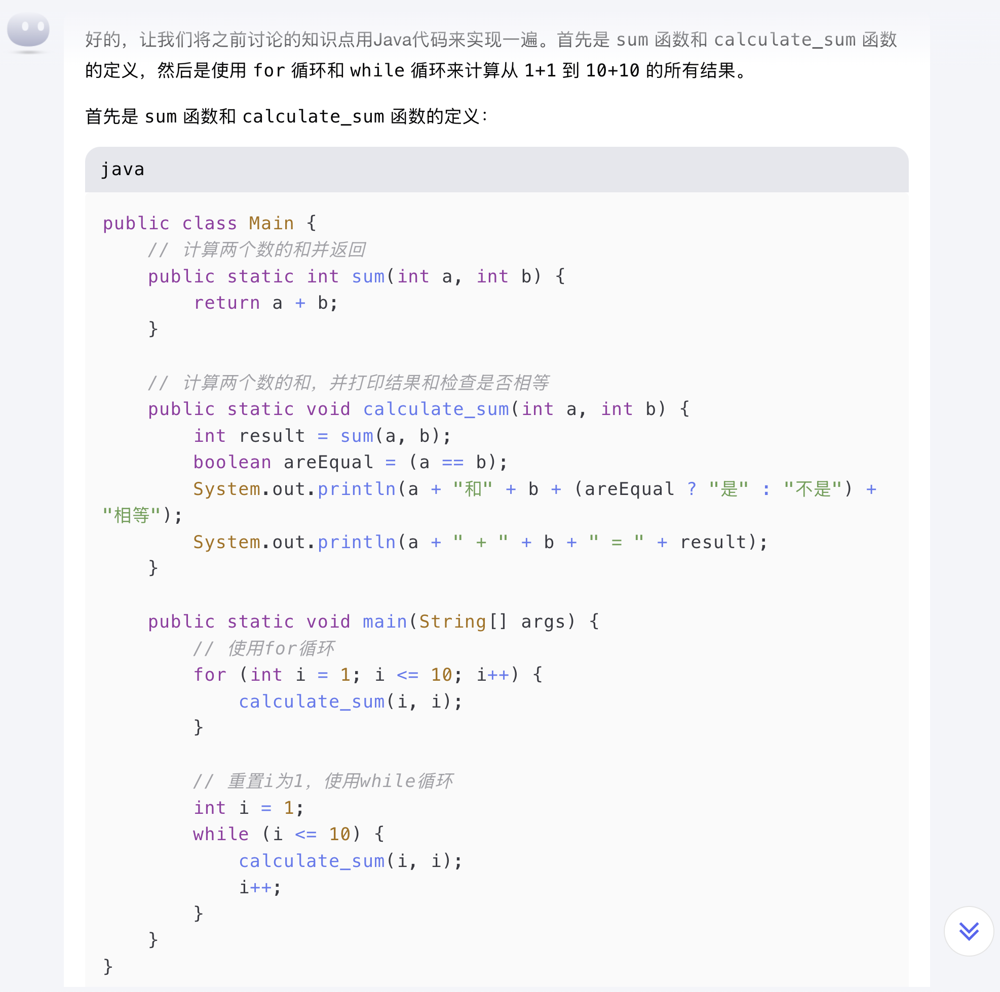

import Tabs from '@theme/Tabs';
import TabItem from '@theme/TabItem';

# 如何成为一名全栈AI辅佐开发者

- 什么是 **AI编程**？
    - 简单来说，就是"_你最好的朋友 - AI，将帮助你编程。_"

- 今天我们将学习什么（`<60分钟`）？
    - 5大主流编程语言 结构性概念
      - Python
      - Java
      - Kotlin
      - TypeScript
      - C#
    - 指挥你的AI小伙伴为你编程
    - 最重要的一件事 - _**庆祝**_ ！🎉
- 学历要求
  - 小学毕业

## 大纲 - 3大模块

> 我们将在一个小时内学习3个模块，每个模块都适用于所有编程语言：变量、函数和类。

## 目的 - Have Fun

我们将探索Java、Kotlin、Python、TypeScript和C#中的变量、函数和类。

记住，我们课程的目标 **不是记住每个细节**，也**不是成为编程大师**，而是理解结构化概念，从而能够构建软件产品，在现实中创造收益$$$。

### 目标不是什么？ {#what-is-not}
:::info 目标不是什么？
- ❌ 不是让你成为编程大师。
- ❌ 不需要掌握所有知识
- ❌ 不必记住编程技巧
- ❌ 不是学习如何编程！！！
:::

### 目标是什么？ {#what-is}
:::tip 我们的目标是什么？
- ✅ 只是学习如何让AI为你编程！
:::

## 变量

:::info
- 每种语言都有变量，比如数学。你只需要搞懂几件事：
  - 每种语言中的基本数据类型是什么？
  - 如何定义一个变量？
  - 如何为变量赋值？
:::

### 基本数据类型

- 数字
- 文字 -> 我们称之为"`String`"
- True / False -> 我们称之为"`Boolean`"
- 集合 -> 我们称之为"`Collection`"
  - 列表 / `List` 或者 数组 / `Array`
  - 字典 / `Dictionary` / `Map`

> "如果我连这些**数据类型**都记不住怎么办？"
- 没问题！只需问ChatGPT或你最喜欢的AI，"_所有流行编程语言中的基本数据类型是什么？_"
- 作业：试一试吧!

### 定义和使用变量

:::info 数据类型的用途
> 那么我们为什么需要理解数据类型呢？

因为我们需要它们来定义变量！
:::

> 就像在数学中我们通常定义一个变量并计算数学公式一样。现在在这一部分，让我们用编程代码解决一个小学一年级的数学问题：

:::info 1 + 1 = ?
:::

:::danger 速度警告 🚗💨💨💨
这是一个很棒的问题！每个人都想知道答案，对吧？

现在我们要用5种不同的编程语言来解决这个著名问题。

请系好安全带！享受这趟加速旅程！🚀
:::

首先让我们看这个问题 - 它是在加两个数字并得到一个结果，所以是3个数字对吧？那么让我们的最好朋友AI来回答这个问题：

```md
# 学习编程语言
## 我正在尝试用Python解决一个数学问题 "1 + 1 = ?"
- 请定义3个变量，然后使用其本机数学算法计算结果并显示
```

现在让我们看看结果：


就是这样！你懂了吗？🎉不要忘记**庆祝**！我们会在最后一节课的结尾帮你庆祝，当你学会所有编程语言时 😄

现在让我们尝试另一种语言，Java、Kotlin、TypeScript和C#


:::info
不要担心如何运行代码，我们会在下一门课程中学习。但告诉你一个秘密，这非常容易！
:::

它们看起来很相似，对吧？是的，就是这样！简单而已！
所以你懂了吗？我猜你懂了！让我们庆祝吧！🎉

:::tip 庆祝
🎉 恭喜！你刚刚学会了如何在所有流行编程语言中定义**数字**变量，只用了1分钟！🎉🎉🎉

现在请大声说出："我现在可以在所有流行编程语言中定义**数字**变量了！" 🎉🕺💃🎉
:::

:::note 其他数据类型？
> "现在我已经学会了数字，那么字符串���布尔值和集合呢？"

- 好问题，记性好！你还记得它们！但也记住我们的目标是让AI为我们编码！实际上，只要你对这些知识有一个概念，你就掌握了！剩下的细节会由你最好的朋友AI来处理！
- 实际上，你会在[下一个模块 - 函数](#functions)中看到它们
> _我们将[不会掌握所有知识](#what-is-not)_
:::

## 函数

### 什么是函数？ {#what-is-function}

> 函数，也称为"方法"或"程序"，就像一个公式：你给一些输入，它会给你一些输出（动作也算一种输出）

### 为什么我们需要函数？ {#why-do-we-need-function}

> 因为人是懒惰的LOL😂，但我们为此自豪LOL😆

:::info 问题2+2=?
让我们证明人是懒惰的，但你是自豪的：
- 你已经知道如何计算1+1，对吧？现在让我们计算2+2=?
- 然后你会计算3+3=?
- 然后4+4=?
- 然后5+5=?
- 然后6+6=?
- ...
:::

我相信这将是你的代码或类似的想法：

```python
# python代码

# 1 + 1
a = 1
b = 1
result = a + b
print(f"{a} + {b} = {result}")

# 2 + 2
c = 2
d = 2
result2 = c + d
print(f"{c} + {d} = {result2}")

# 3 + 3
e = 3
f = 3
result3 = e + f
print(f"{e} + {f} = {result3}")

# 4 + 4
g = 4
h = 4
result4 = g + h
print(f"{g} + {h} = {result4}")

# 5 + 5
i = 5
j = 5
result5 = i + j
print(f"{i} + {j} = {result5}")

# 6 + 6
k = 6
l = 6
result6 = k + l
print(f"{k} + {l} = {result6}")

# 计数：大约~40行代码
```

你感到疲倦了吗？我相信你是！

想成为自豪的懒惰人类开发者吗？我敢打赢你是！

让我们看看AI如何帮助我们解决这个问题：


所以Python中的函数是：

```python
def calculate_sum(a, b):
    result = a + b
    print(f"{a} + {b} = {result}")
```

- 函数的名称`calculate_sum`并不重要，你可以随意命名。
- 如果我们将其重命名为简单的`sum`会怎么样？
  
    ```python
    def sum(a, b):
        result = a + b
        print(f"{a} + {b} = {result}")
    ```

懂了吗？我敢打赢你懂了！这就是函数的基础！

此外，让我们再玩一会儿函数：

1. 函数可以调用另一个函数，就像你的数学公式可以调用另一个数学公式一样，对吧？在这种情况下，我们让`sum`函数返回和结果作为数字，并更新`calculate_sum`函数来调用`sum`函数获取结果并显示它。 
   1. 首先，记住函数可以返回一些输出对吧？所以我们更新`sum`以返回和结果。
   2. 其次，我们更新`calculate_sum`以调用`sum`函数获取结果并显示它，其中��输出实际上是一个动作，即显示结果。
   3. 让我们看看你最好的朋友AI如何做到这一点：
   
2. 此外，让我们再玩一会儿布尔值和字符串：
   1. 让我们在`calculate_sum`中检查a和b是否相等：通过使用新的布尔变量显示"a和b是（不是）相等"。 
   2. 我们将定义一个字符串类型的变量来存储这一部分`"{a} + {b} = {result}"`的显示信息，然后显示它。
   3. 让我们看看你最好的朋友AI如何做到这一点：
   
   
3. 如果我们想计算到`10+10=?`怎么办？
    ```python
    calculate_sum(1, 1)
    calculate_sum(2, 2)
    calculate_sum(3, 3)
    calculate_sum(4, 4)
    calculate_sum(5, 5)
    calculate_sum(6, 6)
    calculate_sum(7, 7)
    calculate_sum(8, 8)
    calculate_sum(9, 9)
    calculate_sum(10, 10)
    ```
4. 想更懒一点？让我们使用"循环"：🚀
   - 
   - 是的，你正在使用"for循环"来做这件事：
        ```python
        for i in range(1, 11):
            calculate_sum(i, i)
        ```
   - 还有一种类型的循环称为"while循环"，这是另一种做法：
   
     - 是的，这就是while循环：
        ```python
        i = 1
        while i <= 10:
            calculate_sum(i, i)
            i += 1
        ```
    - 好了！"循环"看起来更简单了，对吧？我相信你懂了！
      - `for`循环用于已知次数的情况，如`10`， 
      - 而`while`循环用于未知次数但已知条件的情况，如`i <= 10`。
      - 你已经在Python中记住了`for`循环和`while`循环的语法，并且相信我，你的AI朋友可以在对话中随时帮你写出它们，只要你提到"for/while循环"即可 😎
5. 尝试其他编程语言：
    
    
    
    

:::warning 为自己感到自豪
> "为自己是自豪的懒惰人类开发者吗？"
- 是的！我敢打赢你是！而且你应该是！
:::

:::tip 庆祝
🎉 恭喜！你刚刚学会了如何在所有主要编程语言中定义和使用**函数**，只用了10分钟！🎉🎉🎉

现在请大声说出："我现在可以在所���流行编程语言中定义和使用**函数**了！" 🎉🕺💃🎉
:::

## 类

### 什么是类？ {#what-is-class}

类就像一个模具（或模板）。🚗

想象一下你在做玩具汽车：

- 每辆玩具汽车都有轮子、车身和颜色，对吧？🛞🏎️🎨
- 但你不能每次制作新车都从头开始。你需要一个模具，这样每辆车都可以轻松制作。
- 这个模具就是我们所说的类。

在编程中，类就是这个模具：

- 它帮助你定义一个对象（比如汽车）应该具有什么特性（属性）以及它能做什么（函数）。
- 然后你可以使用这个模具制作许多"汽车"（这些汽车是对象）。每辆车都有相同的基本设计，但可以有不同的细节，比如不同的颜色。

使用这个类（模具），你可以方便地重用设计并节省时间。⏱️

例如，"Car"类可能包括：
- 属性：颜色、型号、速度
- 函数：启动、加速、刹车

这样，当你想在程序中创建新车时，你可以使用这个"Car"类模板。这是一种组织和重用代码的方式，使你更容易在程序中创建许多相似的东西。🚙🚗🚕

### 为什么我们需要`类`？ {#why-do-we-need-class}

> 嗯，再说一次，因为人是懒惰的，你想变得更懒一点LOL😂

- `类`可以帮助你以结构化的方式组织你的变量和函数
- `类`可以帮助你重用你自己编写的代码，以及他人的代码
- `类`可以帮助你隐藏细节，只暴露代码的必要部分
- `类`可以帮助你从父类继承属性和方法
- `类`因此可以帮助你写更少的代码

:::tip 汽车模具
```md
让我们在Java中构建一个Car类，它有：
- 速度
- 颜色
- 型号
并且汽车可以做：
- 启动
- 加速
- 刹车
```
再次将上述提示粘贴到你的AI朋友那里，你将得到类似以下的结果：
:::

<details>
    <summary>点击查看Java代码</summary>
    <Tabs>
        <TabItem value="java" label="Java">
        ```java
        public class Car {
            // 汽车的属性
            private int speed;
            private String color;
            private String model;

            // 构造函数，用于初始化汽车的属性
            public Car(String model, String color) {
                this.model = model;
                this.color = color;
                this.speed = 0; // 创建汽车时初始速度为0
            }

            // 启动汽车的方法
            public void start() {
                // 设置默认速���为50
                speed
                System.out.println("汽车已启动。");
            }

            // 加速汽车的方法
            public void accelerate(int increment) {
                if (increment > 0) {
                    speed += increment;
                    System.out.println("汽车已加速。当前速度：" + speed + " km/h");
                } else {
                    System.out.println("无效的加速值。");
                }
            }

            // 刹车并减速的方法
            public void brake(int decrement) {
                if (decrement > 0 && decrement <= speed) {
                    speed -= decrement;
                    System.out.println("汽车已减速。当前速度：" + speed + " km/h");
                } else if (decrement > speed) {
                    speed = 0;
                    System.out.println("汽车已完全停止。");
                } else {
                    System.out.println("无效的刹车值。");
                }
            }

            // 显示汽车详细信息的方法
            public void showDetails() {
                System.out.println("汽车型号：" + model);
                System.out.println("汽车颜色：" + color);
                System.out.println("当前速度：" + speed + " km/h");
            }

            // 使用Car类的主方法，演示如何使用Car类
            public static void main(String[] args) {
                // 创建一个新的汽车对象
                Car myCar = new Car("特斯拉Model 3", "红色");
                // 启动汽车
                myCar.start();
                // 显示汽车详细信息
                myCar.showDetails();
                // 加速汽车
                myCar.accelerate(30);
                // 显示当前详细信息
                myCar.showDetails();
                // 减速汽车
                myCar.brake(10);
                // 进一步加速
                myCar.accelerate(50);
                // 刹车直到完全停止
                myCar.brake(80);
                // 显示最终详细信息
                myCar.showDetails();
            }
        }
        ```
        </TabItem>
    </Tabs>
</details>

:::warning AI可以解释代码
我假设你可以轻松理解这段代码的思路，但如果有任何问题，请随时问你的AI朋友，它会很好地解释它。
:::

:::info 作业
现在是时候看看Car类在Python、Kotlin、TypeScript和C#中的代码是什么样子了��请尝试向你的AI朋友寻求帮助。
相信或不相信，这超级简单！

你可以继续与你的AI朋友对话：
```md
干得好！请将上面的Java代码重写为几种语言，但不要有任何注释：
1. python
2. kotlin
3. typescript
4. c#
```
:::

<details>
    <summary>在你得到结果后，可以随意查看这里</summary>
    <Tabs>
        <TabItem value="python" label="Python">
        ```python
        class Car:
            def __init__(self, model, color):
                self.speed = 0
                self.color = color
                self.model = model

            def start(self):
                print("汽车已启动。")

            def accelerate(self, increment):
                if increment > 0:
                    self.speed += increment
                    print(f"汽车已加速。当前速度：{self.speed} km/h")
                else:
                    print("无效的加速值。")

            def brake(self, decrement):
                if decrement > 0 and decrement <= self.speed:
                    self.speed -= decrement
                    print(f"汽车已减速。当前度：{self.speed} km/h")
                elif decrement > self.speed:
                    self.speed = 0
                    print("汽车已完全停止。")
                else:
                    print("无效的刹车值。")

            def show_details(self):
                print(f"汽车型号：{self.model}")
                print(f"汽车颜色：{self.color}")
                print(f"当前速度：{self.speed} km/h")


        my_car = Car("特斯拉Model 3", "红色")
        my_car.start()
        my_car.show_details()
        my_car.accelerate(30)
        my_car.brake(10)
        my_car.accelerate(50)
        my_car.brake(80)
        my_car.show_details()
        ```
</TabItem>
<TabItem value="kotlin" label="Kotlin">
        ```kotlin
        class Car(val model: String, val color: String) {
            var speed = 0

            fun start() {
                println("汽车已启动。")
            }

            fun accelerate(increment: Int) {
                if (increment > 0) {
                    speed += increment
                    println("汽车已加速。当前速度：$speed km/h")
                } else {
                    println("无效的加速值。")
                }
            }

            fun brake(decrement: Int) {
                if (decrement > 0 && decrement <= speed) {
                    speed -= decrement
                    println("汽车已减速。当前速度：$speed km/h")
                } else if (decrement > speed) {
                    speed = 0
                    println("汽车已完全停止。")
                } else {
                    println("无效的刹车值。")
                }
            }

            fun showDetails() {
                println("汽车型号：$model")
                println("汽车颜色：$color")
                println("当前速度：$speed km/h")
            }
        }

        fun main() {
            val myCar = Car("特斯拉Model 3", "红色")
            myCar.start()
            myCar.showDetails()
            myCar.accelerate(30)
            myCar.brake(10)
            myCar.accelerate(50)
            myCar.brake(80)
            myCar.showDetails()
        }
        ```
</TabItem>
<TabItem value="typescript" label="TypeScript">
        ```typescript
        class Car {
            private speed: number;
            private color: string;
            private model: string;

            constructor(model: string, color: string) {
                this.speed = 0;
                this.color = color;
                this.model = model;
            }

            start(): void {
                console.log("汽车已启动。");
            }

            accelerate(increment: number): void {
                if (increment > 0) {
                    this.speed += increment;
                    console.log(`汽车已加速。当前速度：${this.speed} km/h`);
                } else {
                    console.log("无效的加速值。");
                }
            }

            brake(decrement: number): void {
                if (decrement > 0 && decrement <= this.speed) {
                    this.speed -= decrement;
                    console.log(`汽车已减速。当前速度：${this.speed} km/h`);
                } else if (decrement > this.speed) {
                    this.speed = 0;
                    console.log("汽车已完全停止。");
                } else {
                    console.log("无效的刹车值。");
                }
            }

            showDetails(): void {
                console.log(`汽车型号：${this.model}`);
                console.log(`汽车颜色：${this.color}`);
                console.log(`当前速度：${this.speed} km/h`);
            }
        }

        const myCar = new Car("特斯拉Model 3", "红色");
        myCar.start();
        myCar.showDetails();
        myCar.accelerate(30);
        myCar.brake(10);
        myCar.accelerate(50);
        myCar.brake(80);
        myCar.showDetails();
        ```
</TabItem>
<TabItem value="c#" label="C#">
        ```csharp
        using System;

        class Car {
            private int speed;
            private string color;
            private string model;

            public Car(string model, string color) {
                this.speed = 0;
                this.color = color;
                this.model = model;
            }

            public void Start() {
                Console.WriteLine("汽车已启动。");
            }

            public void Accelerate(int increment) {
                if (increment > 0) {
                    speed += increment;
                    Console.WriteLine($"汽车已加速。当前速度：{speed} km/h");
                } else {
                    Console.WriteLine("无效的加速值。");
                }
            }

            public void Brake(int decrement) {
                if (decrement > 0 && decrement <= speed) {
                    speed -= decrement;
                    Console.WriteLine($"汽车已减速。当前速度：{speed} km/h");
                } else if (decrement > speed) {
                    speed = 0;
                    Console.WriteLine("汽车已完全停止。");
                } else {
                    Console.WriteLine("无效的刹车值。");
                }
            }

            public void ShowDetails() {
                Console.WriteLine($"汽车型号：{model}");
                Console.WriteLine($"汽车颜色：{color}");
                Console.WriteLine($"当前速度：{speed} km/h");
            }
        }

        class Program {
            static void Main() {
                Car myCar = new Car("特斯拉Model 3", "红色");
                myCar.Start();
                myCar.ShowDetails();
                myCar.Accelerate(30);
                myCar.Brake(10);
                myCar.Accelerate(50);
                myCar.Brake(80);
                myCar.ShowDetails();
            }
        }
        ```
</TabItem>
</Tabs>
</details>

:::tip 庆祝
🎉 恭喜！你刚刚学会了如何在所有主要编程语言中定义和使用**类**，只用了10分钟！🎉🎉🎉

现在请大声说出："我现在可以在所有流行编程语言中定义和使用**类**了！" 🎉🕺💃🎉
:::

## 奖励 - 包

:::tip 什么是包？
就像类是属性和方法/函数的好组织者一样，包只是类的好组织者。

但你不必在这一刻掌握`包`，因为你的AI朋友最终会向你展示它的用法。
- 记住我们课程原则：_我们将[不会记住编码技巧](#what-is-not)_
:::

:::info 作业
现在是时候看看Python、Java、Kotlin、TypeScript和C#中的包是什么样子了。请尝试向你的AI朋友寻求帮助。
相信或不相信，这超级简单！而且你会在下一堂课中看到它。
:::

## 庆典

:::tip 毕业典礼
🎉 恭喜！你刚刚在所有主要编程语言中学会了**使用AI辅佐进行编程**，只用了1小时！🎉🎉🎉

现在请大声说出："我现在可以在所有流行编程语言中进行编程了！" 🎉🕺💃🎉
:::