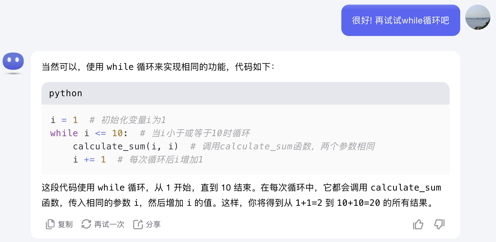

import Tabs from '@theme/Tabs';
import TabItem from '@theme/TabItem';

# 如何成为一名全栈AI辅佐开发者

- 什么是 **AI编程**？
    - 简单来说，就是"_你最好的朋友 - AI，将帮助你编程。_"

- 今天我们将学习什么（`<60分钟`）？
    - 5大主流编程语言 结构性概念
      - Python
      - Java
      - Kotlin
      - TypeScript
      - C#
    - 指挥你的AI小伙伴为你编程
    - 最重要的一件事 - _**庆祝**_ ！🎉
- 学历要求
  - 小学毕业

## 大纲 - 3大模块

> 我们将在一个小时内学习3个模块，每个模块都适用于所有编程语言：变量、函数和类。

## 目的 - Have Fun

我们将探索Java、Kotlin、Python、TypeScript和C#中的变量、函数和类。

记住，我们课程的目标 **不是记住每个细节**，也**不是成为编程大师**，而是理解结构化概念，从而能够构建软件产品，在现实中创造收益$$$。

### 目标不是什么？ {#what-is-not}
:::info 目标不是什么？
- ❌ 不是让你成为编程大师。
- ❌ 不需要掌握所有知识
- ❌ 不必记住编程技巧
- ❌ 不是学习如何编程！！！
:::

### 目标是什么？ {#what-is}
:::tip 我们的目标是什么？
- ✅ 只是学习如何让AI为你编程！
:::

## 变量

:::info
- 每种语言都有变量，比如数学。你只需要搞懂几件事：
  - 每种语言中的基本数据类型是什么？
  - 如何定义一个变量？
  - 如何为变量赋值？
:::

### 基本数据类型

- 数字
- 文字 -> 我们称之为"`String`"
- True / False -> 我们称之为"`Boolean`"
- 集合 -> 我们称之为"`Collection`"
  - 列表 / `List` 或者 数组 / `Array`
  - 字典 / `Dictionary` / `Map`

> "如果我连这些**数据类型**都记不住怎么办？"
- 没问题！只需问ChatGPT或你最喜欢的AI，"_所有流行编程语言中的基本数据类型是什么？_"
- 作业：试一试吧!

### 定义和使用变量

:::info 数据类型的用途
> 那么我们为什么要懂**数据类型**呢？

因为我们需要它们来定义变量, 以及给变量赋值！
:::

> 就像在数学中我们也需要变量(`x`, `y`, `z`等)并计算数学公式。现在让我们用编程的方法做道小学1年级的数学题：

:::info 1 + 1 = ?
:::

:::danger 加速警告 🚗💨💨💨
现在我们要用5种不同的编程语言来解决这个著名问题。

同学们请系好安全带！我们要加速啦！🚀
:::

首先让我们看这个问题 - 它是个什么样的问题呢? 这是给了两个数字而求一个结果，所以是`3个数字`对吧？那么有请我们的好朋友AI, 来回答这个问题：

```md
# 学习编程语言
## 我正在尝试用Python解决一个数学问题 "1 + 1 = ?"
- 请定义3个变量，然后计算加和的结果并显示出来哦
```

现在让我们看看结果：


就是这样！你懂了吗？🎉不要忘记**庆祝**哦！我们也会在最后一个模块的结尾帮你庆祝，非常重要! 😄

现在让我们尝试另几种语言，Java、Kotlin、TypeScript和C#


:::info
不用担心如何运行这些代码，我们会在下一门课程中学习。但偷偷告诉你一个秘密，其实非常容易！
:::

所以你懂了吗？我猜你肯定看懂了！现在让我们庆祝吧！🎉

:::tip 庆祝
🎉 恭喜！你刚刚只用了1分钟就学会了使用5大主流编程语言来定义**数字**变量！🎉🎉🎉

现在请大喊一声："我现在可以用所有主流编程语言中定义**数字**变量了！" 🎉🕺💃🎉
:::

:::note 其他数据类型？
> "现在我已经学会了数字，那么`String`和`Boolean`和集合呢？"

- 好问题! 好记性！嗯 你还记得么? 我们的目标是让AI为我们编码！哈哈哈 实际上，只要你对这些知识有一个概念，就算是已经掌握了！剩下细节的事呢 则交由你最好的朋友AI来处理！
- 而且你也会在[下一个模块 - 函数](#functions)中看到这几种类型哦
> 让我们重温一下我们的目标 _我们[并不需要掌握所有知识](#what-is-not)_
:::

## 函数

### 什么是函数？ {#what-is-function}

> 函数，也称为"方法(method)", 其实也是一种"程序(Program)"，就像一个公式：你给它一些输入(input)，它会给你一些输出(output)（action去执行任务也算一种输出）

### 为啥需要函数？ {#why-do-we-need-function}

> 因为人性皆懒 😂，但我们可以说"我懒我自豪" 哈哈哈😆

:::info 问题2+2=?
让我们证明人是懒惰的，且还懒的自豪：
- 刚才我们学了如何计算1+1，对吧？现在让我们计算2+2=?
- 然后再计算3+3=?
- 然后4+4=?
- 然后5+5=?
- 然后6+6=?
- 以此类推...
:::

我猜你脑子里是这么想的：

```python
# python代码

# 1 + 1
a = 1
b = 1
result = a + b
print(f"{a} + {b} = {result}")

# 2 + 2
c = 2
d = 2
result2 = c + d
print(f"{c} + {d} = {result2}")

# 3 + 3
e = 3
f = 3
result3 = e + f
print(f"{e} + {f} = {result3}")

# 4 + 4
g = 4
h = 4
result4 = g + h
print(f"{g} + {h} = {result4}")

# 5 + 5
i = 5
j = 5
result5 = i + j
print(f"{i} + {j} = {result5}")

# 6 + 6
k = 6
l = 6
result6 = k + l
print(f"{k} + {l} = {result6}")

# 统计一下：从上到下一共大约~40行代码
```

累不累? 我猜你肯定累!

想成为一个"我懒我自豪"的人类程序员吗？我打赌你想！

好的, 我们来看看AI如何帮助我们解决这个问题：


所以用Python写的函数就是：

```python
def calculate_sum(a, b):
    result = a + b
    print(f"{a} + {b} = {result}")
```

- 函数的名称`calculate_sum`并不重要，你可以随意命名, 比如, 咱们给它重命名为`sum`？
  
    ```python
    def sum(a, b):
        result = a + b
        print(f"{a} + {b} = {result}")
    ```

懂了吗？我猜你懂了！这就是一个基础的函数！

函数是最重要的概念, 好, 现在让我们深入玩一下：

1. 函数可以调用另一个函数，就像你的数学公式可以调用���一个数学公式一样，对吧？在这种情况下，我们让`sum`函数返回加和的结果(数字)，同时更新`calculate_sum`函数来调用`sum`函数获取结果并显示它。 
   1. 还记得函数可以输出一些数据, 对吧？所以我们更新`sum`以返回加和的结果。
   2. 其次，我们更新`calculate_sum`以调用`sum`函数获取结果并显示它，所以这个"输出/output"实际上是一个动作，也就是显示结果在电脑屏幕上。
   3. 咱们看看你的AI兄弟怎么做到的：
   
2. 此外，让我们再玩一会儿`Boolean`和字符串`String`：
   1. 让我们在`calculate_sum`中检查`a`和`b`是否相等：通过使用新的`Boolean`变量显示"a和b是（不是）相等"。 
   2. 再定义一个`String`字符串类型的变量来存储这一部分信息, 即`"{a} + {b} = {result}"`，然后显示它。
   3. 咱们再看看你的好朋友AI 如何做到这一点：
   
   
3. 所以 如果我们想计算从`1+1=?`一直到`10+10=?`怎么办？
    ```python
    calculate_sum(1, 1)
    calculate_sum(2, 2)
    calculate_sum(3, 3)
    calculate_sum(4, 4)
    calculate_sum(5, 5)
    calculate_sum(6, 6)
    calculate_sum(7, 7)
    calculate_sum(8, 8)
    calculate_sum(9, 9)
    calculate_sum(10, 10)
    ```
4. 想再懒一点？可以的! 这次我们使用"**循环**语句"：🚀
   - 
   - 对的 这就是"**for循环**"：
        ```python
        for i in range(1, 11):
            calculate_sum(i, i)
        ```
   - 好事成双, 还有一种循环类型叫做 "**while循环**"：
   
     - 所以 这段就是while循环：
        ```python
        i = 1
        while i <= 10:
            calculate_sum(i, i)
            i += 1
        ```
    - 好了！"循环"是不是看起来更简单了？我相信你已经懂了！😎
      - 通常来说, `for`循环用于**已知次数**的情况，如`10`， 
      - 而`while`循环用于未知次数但**已知条件**的情况，如`i <= 10`。
      - 你已经在Python中学会了`for`循环和`while`循环的玩法啦! 相信我，你的AI兄弟肯定可以随时帮你写出它们，只要你提到"**for/while loop/循环**"即可 😎
5. 我们的课程是要贯通5大主流高级语言, 现在咱们一起尝试下其他编程语言：
    
    
    
    

:::warning 为自己的懒人性而自豪
> "有没有感觉到, 为自己是懒惰的人类开发者而自豪吗?"
- 这个可以有哦!
:::

:::tip 庆祝
🎉 恭喜你呀恭喜你！你只用了10分钟就已经学会了使用5大主流编程语言去定义和使用**函数**！🎉🎉🎉

现在请大唱一声："本帝君(公主)已然可以用所有的主流编程语言 去定义和使用**函数**了！" 🎉🕺💃🎉
:::

## 类

### 什么是类？ {#what-is-class}

类就像一个模具或模板 比如说汽车🚗 想象一下你在做玩具汽车：

- 每辆玩具汽车都有轮子、车身和颜色，对吧？🛞🏎️🎨
- 但你不能每次制作新车都从头开始。你需要一个模具，这样每辆车都可以用它轻松制作出来。
- 这个模具就是我们所说的类 (class)。

在编程中，类就是这个模具：

- 它帮助你定义一个对象（比如汽车）应该具有什么特性（属性）以及它能做什么（函数）。
- 然后你可以使用这个模具制作许多"汽车"（这些汽车是"对象" - 此处"对象"指的是类的实例 即新生产出来的车, 而不是你的"_另一半_"哈）。
- 每辆车都有相同的基本设计，但可以有不同的细节，比如不同的颜色, 发动机, 加速能力, 等等

使用这个类（模具），你可以方便地重用设计并节省时间。⏱️

例如，"Car"的class(类)可能包括：
- 属性：颜色、型号、速度
- 函数：启动、加速、刹车

这样的话，当你想在程序中创建一辆新车时，你可以使用这个"Car"类模具。这是一种重用代码的懒人方式，使你更容易在写程序的过程中少写好几行代码 哈哈哈。🚙🚗🚕

### 为什么我们需要这个 `Class/类`？ {#why-do-we-need-class}

> 嗯，再说一次，因为"人性皆懒"，我们尊重人性, 所以其实, 你还想变得更懒一点 哈哈哈 真实真的 😂

- `类` 可以帮助你以结构化的方式组织你的变量和函数
- `类` 可以帮助你重复使用你自己编写的代码，以及他人的代码
- `类` 可以帮助你隐藏细节，只暴露代码的必要部分
- `类` 因此可以帮助你少写很多的代码

:::tip Car Class
```md
让我们在Java中构建一个Car的Class (类)，它有一些特征：
- 速度
- 颜色
- 型号
并且还有些功能：
- 启动
- 加速
- 刹车
```
再次将上述提示词(**prompt**) 粘贴给你的AI兄弟 => 得到差不多这样的结果：
:::

<details>
    <summary>点击查看Java代码</summary>
    <Tabs>
        <TabItem value="java" label="Java">
        ```java
        public class Car {
            // 汽车的属性
            private int speed;
            private String color;
            private String model;

            // 构造函数，用于初始化汽车的属性
            public Car(String model, String color) {
                this.model = model;
                this.color = color;
                this.speed = 0; // 创建汽车时初始速度为0
            }

            // 启动汽车的方法
            public void start() {
                // 设置默认速度为50
                speed = 50;
                System.out.println("汽车已启动。");
            }

            // 加速汽车的方法
            public void accelerate(int increment) {
                if (increment > 0) {
                    speed += increment;
                    System.out.println("汽车已加速。当前速度：" + speed + " km/h");
                } else {
                    System.out.println("无效的加速值。");
                }
            }

            // 刹车并减速的方法
            public void brake(int decrement) {
                if (decrement > 0 && decrement <= speed) {
                    speed -= decrement;
                    System.out.println("汽车已减速。当前速度：" + speed + " km/h");
                } else if (decrement > speed) {
                    speed = 0;
                    System.out.println("汽车已完全停止。");
                } else {
                    System.out.println("无效的刹车值。");
                }
            }

            // 显示汽车详细信息的方法
            public void showDetails() {
                System.out.println("汽车型号：" + model);
                System.out.println("汽车颜色：" + color);
                System.out.println("当前速度：" + speed + " km/h");
            }

            // 使用Car类的主方法，演示如何使用Car类
            public static void main(String[] args) {
                // 创建一个新的汽车对象
                Car myCar = new Car("特斯拉Model 3", "红色");
                // 启动汽车
                myCar.start();
                // 显示汽车详细信息
                myCar.showDetails();
                // 加速汽车
                myCar.accelerate(30);
                // 显示当前详细信息
                myCar.showDetails();
                // 减速汽车
                myCar.brake(10);
                // 进一步加速
                myCar.accelerate(50);
                // 刹车直到完全停止
                myCar.brake(80);
                // 显示最终详细信息
                myCar.showDetails();
            }
        }
        ```
        </TabItem>
    </Tabs>
</details>

:::warning AI能解释代码
估计你应该可以轻松理解这段代码的思路，但如果有任何困惑，请随时问你的AI兄弟，它对于这点小事还是能应付的。
:::

:::info 作业
现在是时候看看Car Class (类) 在Python、Kotlin、TypeScript和C#中的代码是什么样子了。来, 继续问你的AI兄弟。

来, 跟它继续刚才的对话：
```md
不错！请将上面的Java代码重写为另外几种语言，但这次不用注释：
1. python
2. kotlin
3. typescript
4. c#
```
:::

<details>
    <summary>不要偷懒哦 等你有了结果再点这看</summary>
    <Tabs>
        <TabItem value="python" label="Python">
        ```python
        class Car:
            def __init__(self, model, color):
                self.speed = 0
                self.color = color
                self.model = model

            def start(self):
                self.speed = 50
                print("汽车已启动。")

            def accelerate(self, increment):
                if increment > 0:
                    self.speed += increment
                    print(f"汽车已加速。当前速度：{self.speed} km/h")
                else:
                    print("无效的加速值。")

            def brake(self, decrement):
                if decrement > 0 and decrement <= self.speed:
                    self.speed -= decrement
                    print(f"汽车已减速。当前速度：{self.speed} km/h")
                elif decrement > self.speed:
                    self.speed = 0
                    print("汽车已完全停止。")
                else:
                    print("无效的刹车值。")

            def show_details(self):
                print(f"汽车型号：{self.model}")
                print(f"汽车颜色：{self.color}")
                print(f"当前速度：{self.speed} km/h")


        my_car = Car("特斯拉Model 3", "红色")
        my_car.start()
        my_car.show_details()
        my_car.accelerate(30)
        my_car.brake(10)
        my_car.accelerate(50)
        my_car.brake(80)
        my_car.show_details()
        ```
</TabItem>
<TabItem value="kotlin" label="Kotlin">
        ```kotlin
        class Car(val model: String, val color: String) {
            var speed = 0

            fun start() {
                speed = 50
                println("汽车已启动。")
            }

            fun accelerate(increment: Int) {
                if (increment > 0) {
                    speed += increment
                    println("汽车已加速。当前速度：$speed km/h")
                } else {
                    println("无效的加速值。")
                }
            }

            fun brake(decrement: Int) {
                if (decrement > 0 && decrement <= speed) {
                    speed -= decrement
                    println("汽车已减速。当前速度：$speed km/h")
                } else if (decrement > speed) {
                    speed = 0
                    println("汽车已完全停止。")
                } else {
                    println("无效的刹车值。")
                }
            }

            fun showDetails() {
                println("汽车型号：$model")
                println("汽车颜色：$color")
                println("当前速度：$speed km/h")
            }
        }

        fun main() {
            val myCar = Car("特斯拉Model 3", "红色")
            myCar.start()
            myCar.showDetails()
            myCar.accelerate(30)
            myCar.brake(10)
            myCar.accelerate(50)
            myCar.brake(80)
            myCar.showDetails()
        }
        ```
</TabItem>
<TabItem value="typescript" label="TypeScript">
        ```typescript
        class Car {
            private speed: number;
            private color: string;
            private model: string;

            constructor(model: string, color: string) {
                this.speed = 0;
                this.color = color;
                this.model = model;
            }

            start(): void {
                this.speed = 50;
                console.log("汽车已启动。");
            }

            accelerate(increment: number): void {
                if (increment > 0) {
                    this.speed += increment;
                    console.log(`汽车已加速。当前速度：${this.speed} km/h`);
                } else {
                    console.log("无效的加速值。");
                }
            }

            brake(decrement: number): void {
                if (decrement > 0 && decrement <= this.speed) {
                    this.speed -= decrement;
                    console.log(`汽车已减速。当前速度：${this.speed} km/h`);
                } else if (decrement > this.speed) {
                    this.speed = 0;
                    console.log("汽车已完全停止。");
                } else {
                    console.log("无效的刹车值。");
                }
            }

            showDetails(): void {
                console.log(`汽车型号：${this.model}`);
                console.log(`汽车颜色：${this.color}`);
                console.log(`当前速度：${this.speed} km/h`);
            }
        }

        const myCar = new Car("特斯拉Model 3", "红色");
        myCar.start();
        myCar.showDetails();
        myCar.accelerate(30);
        myCar.brake(10);
        myCar.accelerate(50);
        myCar.brake(80);
        myCar.showDetails();
        ```
</TabItem>
<TabItem value="c#" label="C#">
        ```csharp
        using System;

        class Car {
            private int speed;
            private string color;
            private string model;

            public Car(string model, string color) {
                this.speed = 0;
                this.color = color;
                this.model = model;
            }

            public void Start() {
                speed = 50;
                Console.WriteLine("汽车已启动。");
            }

            public void Accelerate(int increment) {
                if (increment > 0) {
                    speed += increment;
                    Console.WriteLine($"汽车已加速。当前速度：{speed} km/h");
                } else {
                    Console.WriteLine("无效的加速值。");
                }
            }

            public void Brake(int decrement) {
                if (decrement > 0 && decrement <= speed) {
                    speed -= decrement;
                    Console.WriteLine($"汽车已减速。当前速度：{speed} km/h");
                } else if (decrement > speed) {
                    speed = 0;
                    Console.WriteLine("汽车已完全停止。");
                } else {
                    Console.WriteLine("无效的刹车值。");
                }
            }

            public void ShowDetails() {
                Console.WriteLine($"汽车型号：{model}");
                Console.WriteLine($"汽车颜色：{color}");
                Console.WriteLine($"当前速度：{speed} km/h");
            }
        }

        class Program {
            static void Main() {
                Car myCar = new Car("特斯拉Model 3", "红色");
                myCar.Start();
                myCar.ShowDetails();
                myCar.Accelerate(30);
                myCar.Brake(10);
                myCar.Accelerate(50);
                myCar.Brake(80);
                myCar.ShowDetails();
            }
        }
        ```
</TabItem>
</Tabs>
</details>

:::tip 庆祝一下
🎉 恭喜！你只用了10分钟就刚刚学会了使用5大主流编程语言来定义和使用**类**！🎉🎉🎉

现在请大声对自己说："我现在已经懂了5大主流编程语言是怎么**搞对象**的啦 哈哈哈哈哈哈！" 🎉🕺💃🎉
:::

## 附加题 - 包 package {#package}

:::tip 什么是 package (包)？
就像类是属性和方法/函数的管理者一样，包只是类的管理者。

但你不必在这一刻掌握`包`，因为你的AI兄弟总有一天会陪你玩明白。
- 再次重温一下我们课程的原则：_我们[不必记住编码技巧](#what-is-not)_
:::

:::info 作业
现在是时候看看Python、Java、Kotlin、TypeScript和C#中的包是什么样子了。请尝试向你的AI朋友寻求帮助。
相信或不相信，这超级简单！而且你会在下一堂课中看到它。
:::

## 毕业啦

:::tip 毕业典礼
🎉 恭喜你呀恭喜你！你刚刚只用了1小时 学会了5大主流编程语言的**AI编程** 实力跃迁到了新的境界 可喜可贺！🎉🎉🎉

现在请大声唱出来："我现在可以用所有主流语言进行AI编程了！" 🎉🕺💃🎉 
然后去群里跟大家分享你的喜悦吧！
:::